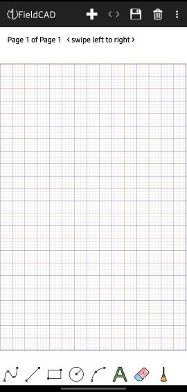

## **Android Applications Projects**

  
  
  
  
   
   
   

## **AutoCAD Add-Ons** - (VisualLisp)
&nbsp; Block System  
&nbsp; Hex Fasteners  
&nbsp; Partial Line  
&nbsp; Steel Sections  
&nbsp; Steel Shapes Plus  
&nbsp;&nbsp; [The Basic](https://addcom.github.io/Structural-Steel-Shape/) [- Direct Draw](https://addcom.github.io/Steel-Shape-Plus-Direct-Draw/) [- The Editor](https://addcom.github.io/Steel-Shape-Plus-Editor/) [- Direct Pick](https://addcom.github.io/Steel-Shape-Plus-Direct-Pick/)  
&nbsp; Weld Symbols  
&nbsp;&nbsp; [The Basic](https://addcom.github.io/WeldSymbols/)  

## **Inventor Add-Ons** - (macros)  
&nbsp; Steel Shape for 2D Sketch Macro [View Info](https://inventor-add-on.github.io/SteelShape-Macro/)  
