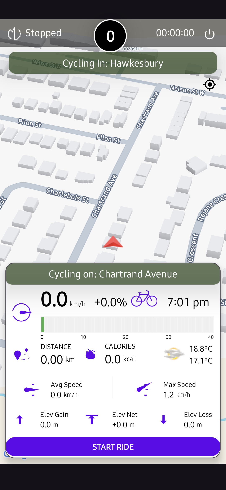
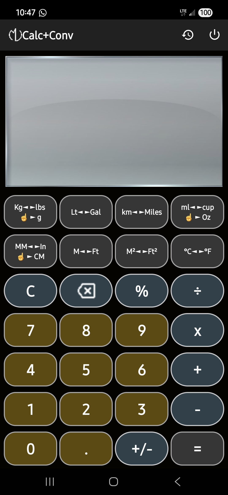
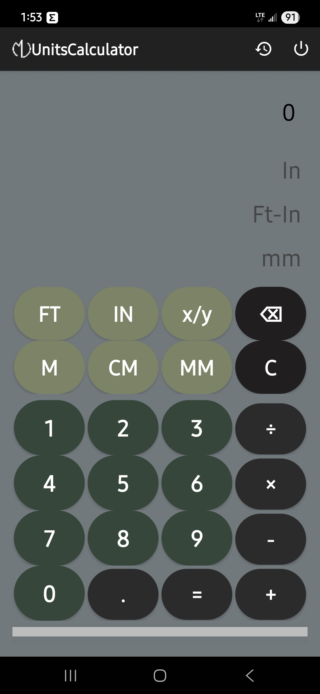
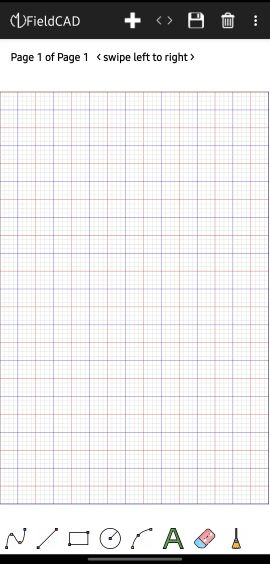
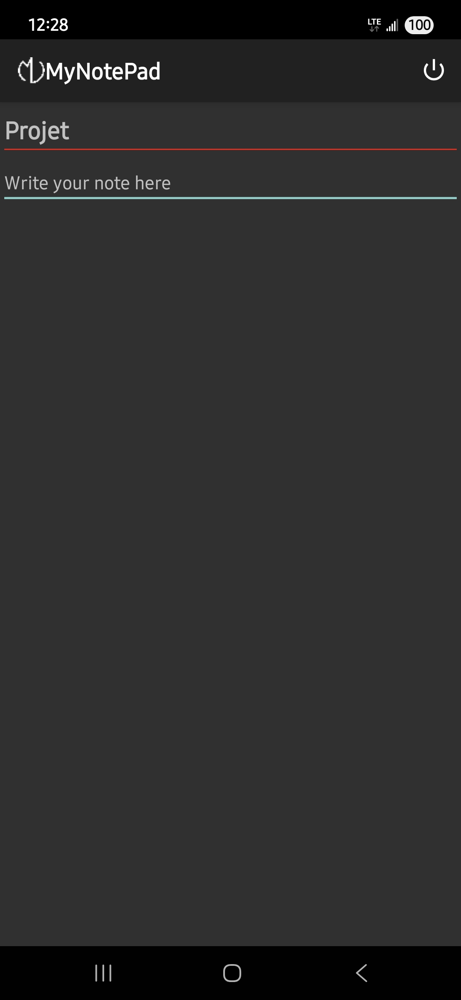
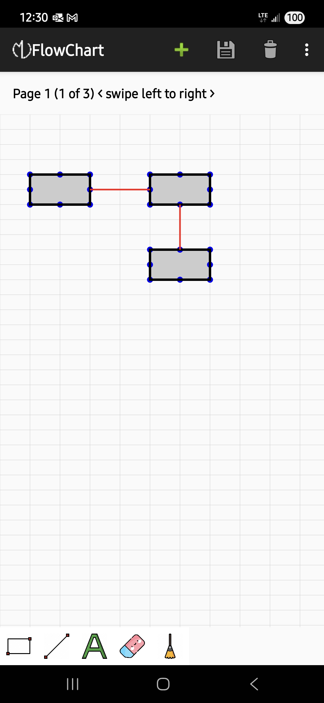
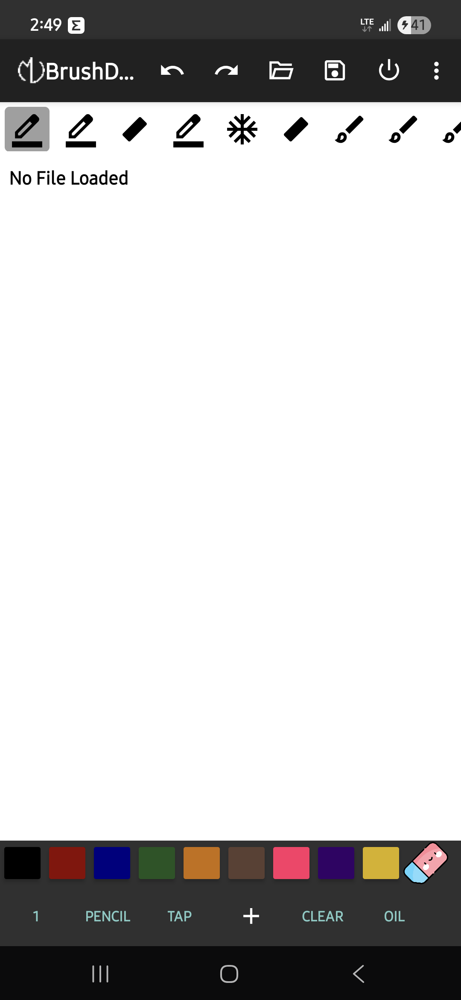

<!DOCTYPE html>
<html lang="en">
<head>
<meta charset="UTF-8">
<meta name="viewport" content="width=device-width, initial-scale=1.0">
<title>MichelVilleneuve's Projects</title>

</head>
<body>

  <h1 class="site-title">MichelVilleneuve's Projects</h1>

  <!-- CyclingTracker -->
  <figure class="gallery-item">
    

      
      
Click to see full features

    

    <figcaption>CyclingTracker</figcaption>
  </figure>

  <!-- CalcConv -->
  <figure class="gallery-item">
    

      
      
Click to see full features

    

    <figcaption>CalcConv</figcaption>
  </figure>
  
<!-- UnitsCalculator --> 
<figure class="gallery-item">
  

    
    
Click to see full features

  

  <figcaption>UnitsCalculator</figcaption>
</figure>

<!-- FieldCAD --> 
<figure class="gallery-item">
  

    
    
Click to see full features

  

  <figcaption>FieldCAD</figcaption>
</figure>

<!-- NotePad --> 
<figure class="gallery-item">
  

    
    
Click to see full features

  

  <figcaption>NotePad</figcaption>
</figure>

<!-- FlowChart --> 
<figure class="gallery-item">
  

    
    
Click to see full features

  

  <figcaption>FlowChart</figcaption>
</figure>

<!-- BrushDraw --> 
<figure class="gallery-item">
  

    
    
Click to see full features

  

  <figcaption>BrushDraw</figcaption>
</figure>

<!-- Lightbox structure -->

  &times;
  &#10094;
  
  &#10095;
  

<footer>
  
&copy; 2025 MichelVilleneuve

</footer>

</body>
</html>
