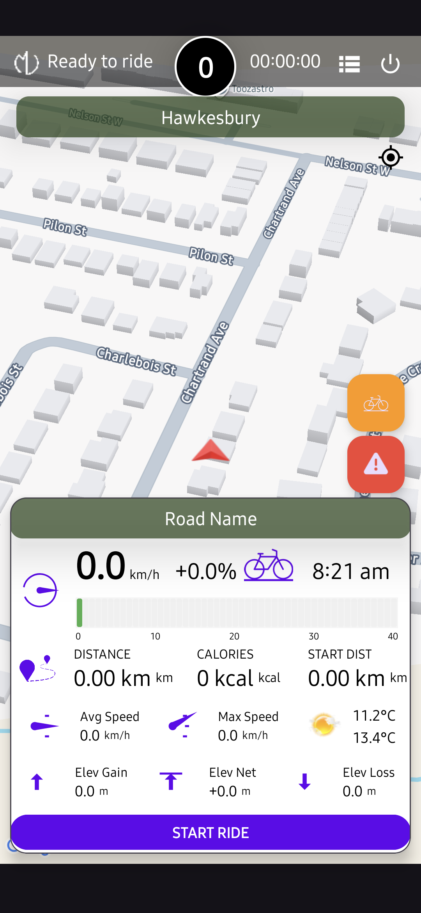

<link rel="stylesheet" href="/assets/css/style.css">

<figure class="gallery-item">
  

    
    

      <strong>Features:</strong>
      <ul>
        <li>Distance</li>
        <li>Road Slope</li>
        <li>Calories</li>
        <li>Current Time</li>
        <li>AVG Speed</li>
        <li>Max Speed</li>
        <li>Elevation Gain</li>
        <li>Elevation Loss</li>
        <li>Elevation Net</li>
      </ul>
    

  

  <figcaption>CyclingTracker</figcaption>
</figure>

  <figure class="gallery-item">
    <a href="https://michelvilleneuve.github.io/">
      
      <figcaption>CalcConv</figcaption>
    </a>
  </figure>

  <figure class="gallery-item">
    <a href="https://michelvilleneuve.github.io/">
      
      <figcaption>UnitsCalculator</figcaption>
    </a>
  </figure>

  <figure class="gallery-item">
    <a href="https://michelvilleneuve.github.io/">
      
      <figcaption>FieldCAD</figcaption>
    </a>
  </figure>

  <figure class="gallery-item">
    <a href="https://michelvilleneuve.github.io/">
      
      <figcaption>NotePad</figcaption>
    </a>
  </figure>

  <figure class="gallery-item">
    <a href="https://michelvilleneuve.github.io/">
      
      <figcaption>FlowChart</figcaption>
    </a>
  </figure>

  <figure class="gallery-item">
    <a href="https://michelvilleneuve.github.io/">
      
      <figcaption>BrushDraw</figcaption>
    </a>
  </figure>

<footer>
  
&copy; 2025 MichelVilleneuve

</footer>
